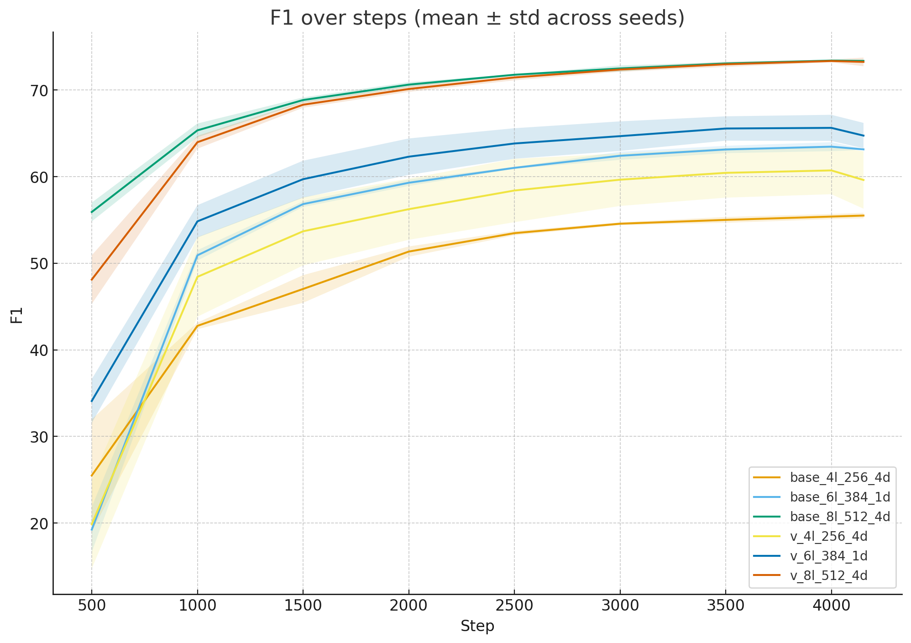

# Value-Bypass Attention: A Simple Value-Path Variant for BERT on SQuAD v1

This repository contains experimental results for a simple modification to the BERT self-attention mechanism.  
The **value-bypass variant (v)** augments the value vectors with a shortcut from the input representation:

```math
V' = V + α • ReLU(x)
```

The scaling factor (0.5) was chosen arbitrarily.  
Although simple, this change showed an interesting trade-off: **higher mean performance in smaller models but increased variance across seeds**.

Checkpoints for 6L/8L models are unavailable due to resource limits.

---

## Report
A short report (`report/VALUE_BYPASS_ATTENTION_A_SIMPLE_VALUE_PATH_VARIANT_FOR_BERT_ON_SQUAD_V1.pdf`) is included, summarizing:
- Motivation and method
- Pretraining and fine-tuning setup
- Results (mean ± std across seeds)
- Discussion, limitations, and conclusion

---

## Experimental Setup

### Pretraining
- **Corpus**: Slice of English Wikipedia (~0.6B tokens)
- **Tokenizer**: `bert-base-uncased`  
- **Objective**: MLM only  
- **Schedule**:  
  - warm stage: seq len=128, batch=48, 65k steps  
  - long stage: seq len=512, batch=48, 15k steps  
- **Optimizer**: AdamW (betas=0.9,0.999, eps=1e-8, wd=0.01)  
- **Scheduler**: linear warmup + decay  

### Fine-tuning (SQuAD v1)
- **Epochs**: 3 (~4.1k steps)  
- **Batch size**: 64  
- **Learning rate**: 5e-5  
- **Optimizer**: HF Trainer default  
- **Evaluation**: HuggingFace  
- **Seeds**: 4L-256 (5 seeds: 42, 2, 8, 9, 5), 6L/8L (3 seeds: 42, 2, 8)  

---

## Results

| Model   | Base F1       | v F1          | ΔMean | ΔStd |
|---------|---------------|---------------|-------|------|
| 4L-256  | 55.51 ± 0.32  | 59.62 ± 3.32  | +4.1  | ×10↑ |
| 6L-384  | 63.15 ± 0.07  | 64.74 ± 1.47  | +1.6  | ×20↑ |
| 8L-512  | 73.37 ± 0.12  | 73.26 ± 0.50  | ≈0    | ×4↑ |

- **Smaller models**: higher mean F1, but large variance  
- **Larger models**: negligible mean difference, variance still ↑  



---

## Discussion
- The bypass acts as a **residual shortcut of positive activations**, improving information flow in small models.  
- However, it bypasses attention selectivity → **unstable training, seed-sensitive results**.  
- Variance analysis suggests output variance cannot decrease when the ReLU(x) term is injected.  
- Larger models already preserve information, so the bypass becomes redundant.

---

## Limitations
- Pretraining size = 0.6B tokens (20% of BERT-base)  
- Only one downstream task (SQuAD v1)  
- Limited seeds (5 for 4L, 3 for 6L/8L)  
- α fixed at 0.5, no tuning  
- Last-step checkpoints only  
- 6L/8L checkpoints unavailable  
- Implementation relied on custom skeleton + weight load; bypass path not unit-tested

---

## Repository Contents

- results/ # mean_std.csv, full_stats_seeds.csv
- report/ # VALUE_BYPASS_ATTENTION_A_SIMPLE_VALUE_PATH_VARIANT_FOR_BERT_ON_SQUAD_V1.pdf (summary of the study)
- models/ # checkpoints of some models. other tests are lost due to resources being cut.
- root # contains sources. run full_recital.py for pretraining-psp-squadv1 test. use configs.py to modify bert models. untested in other conditions.

---

## Disclaimers

- This Repository is based on HuggingFace's Transformers. (Apache 2.0)
- This Repository does not guarantee reproducibility.
- Code, report, and this README were assisted with generative AI.

---

If you use this repository, please cite it:
```bibtex
@misc{shin2025valuebypass,
  author       = {D.B. Shin},
  title        = {Value-Bypass Attention: A Simple Value-Path Variant for BERT on SQuAD v1},
  year         = {2025},
  howpublished = {\url{https://github.com/tls8012/Value-Bypass-Attention}},
  note         = {Simple experimental report}
}
```